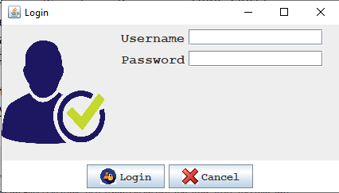
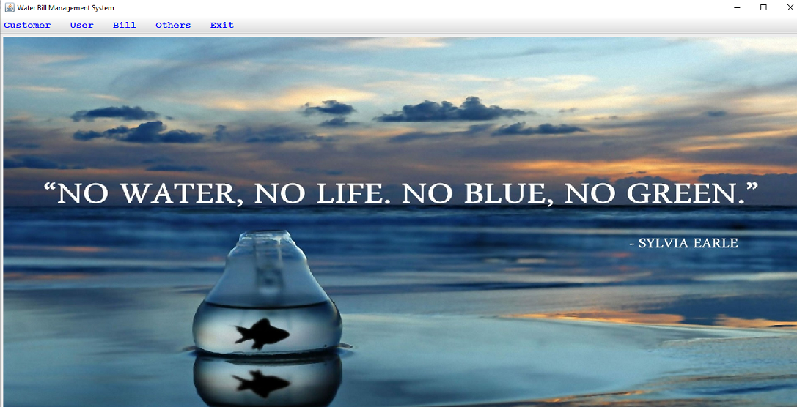
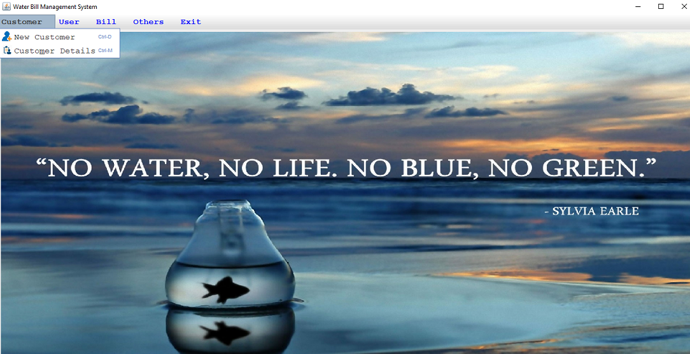

<h1> Water Bill Management System</h1>

Language used - Java Swings, Java awt, Sql

Database used - Mysql

Functions :

<ul>
  <li>It is a water bill amangement system to calculate bill and calculates bill using the meter no.</li>
   <li>Admin logins into the system and can perform the following operations :
     
     1. logins into the system.
     2. Can generate bills of a customer.
     3. Can view Customers data.
     4. can calucate the bill of a particular customer.
     5. Can add new customers/consumers to the data base.
     6. Can click on exit option to exit from the application.
     7. Has shortcut keys for basic operations such as enetering new data etc.
   </li>
   
   <li>Has various links to the exe(application files) within the system and can open them i.e, notepad, calculator, chrome.</li>
   
</ul>

<h3>Login screen automatically appears after this screen.</h3>

<h3>Login screen</h3>

<h3>Project Screen- Main page appears after entering login creditials</h3>

<h3>In the first menubar item a drop down menu bar appears in which we have 2 options</h3>

<h3>Adding new customer</h3>

<h3>Viewing existing customer details</h3>

<h3>Calculating and updating existing bill</h3>

<h3>generating new bill</h3>

<h3>After we choose the meter no we generate a bill having all details</h3>

