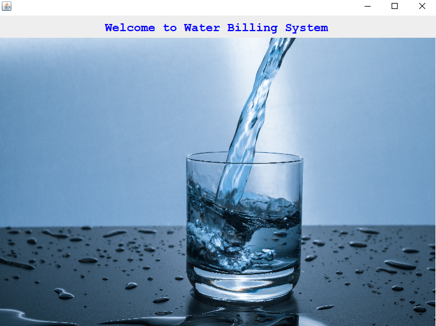

<h1> Water Bill Management System</h1>

Language used - Java Swings, Java awt, Sql
Database used - Mysql

Functions :

<ul>
  <li>It is a water bill amangement system to calculate bill and calculates bill using the meter no.</li>
   <li>Admin logins into the system and can perform the following operations :
     
     1. logins into the system.
     2. Can generate bills of a customer.
     3. Can view Customers data.
     4. can calucate the bill of a particular customer.
     5. Can add new customers/consumers to the data base.
     6. Can click on exit option to exit from the application.
     7. Has shortcut keys for basic operations such as enetering new data etc.
   </li>
   
   <li>Has various links to the exe(application files) within the system and can open them i.e, notepad, calculator, chrome.</li>
   
</ul>

1. Login screen automatically appears after this screen.

